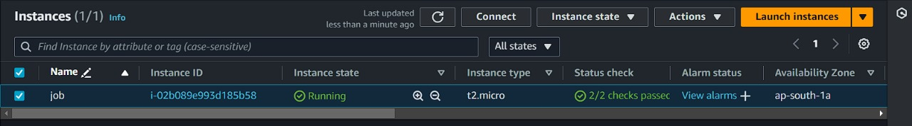

# Project Title

A brief description of your project.

## Table of Contents
- [Installation](#installation)

- [Images](#images)
- [HOSTING](#HOSTING)

## Installation
To install the project dependencies, run the following command:
```bash
npm install
npm run dev
```

## Hosting
- This project is hosted on AWS EC2 for the backend.

## Images
### AWS Instance Image


### Running Instance Image
  
