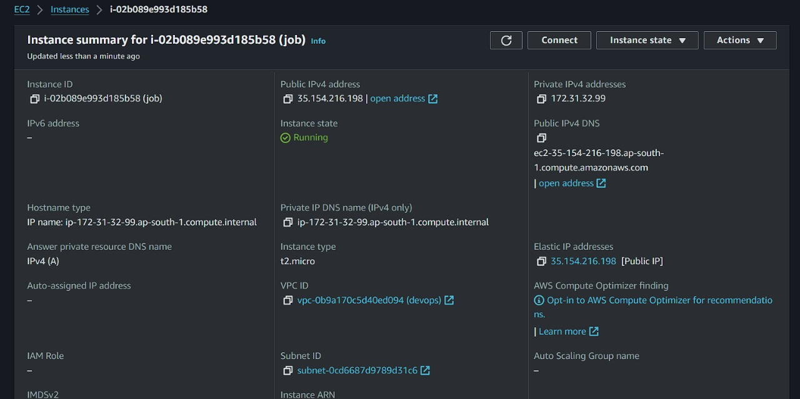

# Project Title

A brief description of your project.

## Table of Contents
- [Installation](#installation)
- [Usage](#usage)
- [Images](#images)
- [License](#license)

## Hosting
- This project is hosted on AWS EC2 for the backend.

## Images
  // Use a relative path instead of an absolute path

